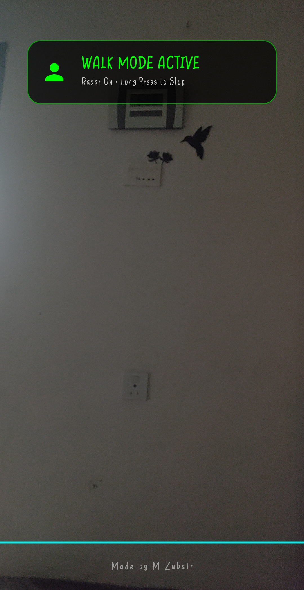

# binAI - Visual Assistant & Mobility Radar for the Blind

**binAI** is a cutting-edge, voice-controlled Android application designed to assist totally blind and visually impaired individuals. It acts as a real-time mobility instructor and visual assistant, combining lightning-fast on-device sensors with powerful Google Vertex AI cloud models to keep users safe and aware of their surroundings.

Made by **M Zubair**.

## ✨ Key Features

*   🚶‍♂️ **Real-Time Walk Mode (Radar):** Uses on-device object detection to calculate exact distances in feet. It provides real-time evasion commands (e.g., "Wall 3 feet, move right") and dynamic audio beeps that speed up as obstacles get closer.
*   👥 **Instant Face Recognition:** Automatically detects and identifies known family members in real-time. Features an auto-rotation algorithm to catch faces even if the phone is held at an angle.
*   🔍 **Scene Analysis & Object Finding:** Users can ask "What is in front of me?" or "Find my keys." The AI will scan the room, describe the scene spatially, and guide the user using clock directions.
*   📖 **Text Reading:** Swipe down to instantly read documents, signs, or labels in the environment.
*   📴 **Offline Emergency Mode:** If the internet connection drops, the app seamlessly switches to on-device ML Kit models to continue providing obstacle warnings and text reading without missing a beat.
*   🎙️ **Gesture & Voice Controlled:** Designed specifically for accessibility. Users can wave their hand over the phone's proximity sensor to trigger voice commands, double-tap to analyze scenes, or long-press to activate the walking radar.

## 🛠️ Tech Stack

### Frontend (Android)
*   **Language:** Kotlin
*   **UI Framework:** Jetpack Compose
*   **Camera:** CameraX (with auto-torch for dark environments)
*   **On-Device AI:** Google ML Kit (Object Detection, Face Detection, Text Recognition, Image Labeling)
*   **Concurrency:** Kotlin Coroutines & Async/Await for simultaneous radar and face scanning.

### Backend (Google Cloud)
*   **Language:** Python 3
*   **Framework:** FastAPI
*   **AI Models:** Google Cloud Vertex AI (Gemini 2.5 Flash / Pro)
*   **Face Recognition:** `face_recognition` library with custom NumPy distance calculations for high-accuracy family matching.
*   **Deployment:** Dockerized and hosted on **Google Cloud Run** with auto-scaling (scales to 0 to save costs) and CI/CD via Google Cloud Build.

## 🚀 How It Works (Hybrid Architecture)
To provide the fastest and safest experience, binAI uses a hybrid edge-to-cloud approach:
1. **The Edge (Phone):** The Android app processes camera frames locally at high speeds to detect bounding boxes, calculate obstacle distances, and find faces.
2. **The Cloud (Server):** The app injects this mathematical sensor data into a prompt alongside the compressed image and sends it to the FastAPI backend.
3. **The Brain (Vertex AI):** The Gemini model reads the image *and* the exact sensor data to generate highly accurate, spatial, and urgent instructions (e.g., "STOP! Stairs going down").

## 📝 Usage Instructions for Users
*   **Wave Hand:** Hover hand over the top of the phone (proximity sensor) to speak a command.
*   **Double Tap:** Instantly analyze the current scene.
*   **Long Press:** Toggle Walk Mode (Radar) on or off.
*   **Swipe Down:** Read text in front of the camera.
*   **Swipe Up + "Who is this":** Check for family members.
